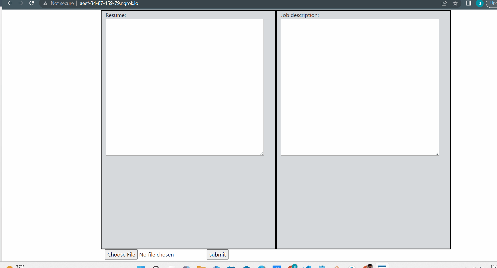

# **ATS RESUME CHECKER**
 
# Introduction

Welcome to the Resume Keyword Scanner Demo App! This application is designed to assist job seekers in optimizing their resumes for job applications by ensuring they include the necessary skills and keywords sought by employers.

## Purpose

The purpose of this project is to:

- Offer job seekers a valuable tool for enhancing their chances of securing interviews and job offers.
- Provide an intelligent and user-friendly platform to scan and analyze resumes in comparison to job descriptions.
- Identify skills and keywords that are missing from the job seeker's resume but are present in the job posting.
- Empower job seekers with insights into how well their resume aligns with the requirements of a specific job opportunity.

With the Resume Keyword Scanner, you can save time and increase your chances of success in your job search by tailoring your resume to meet the specific needs of potential employers.

## DEMO APP

You can access the demo app to experience how the Resume Keyword Scanner works and see how it can benefit you as a job seeker.

 

**DEMO APP**

